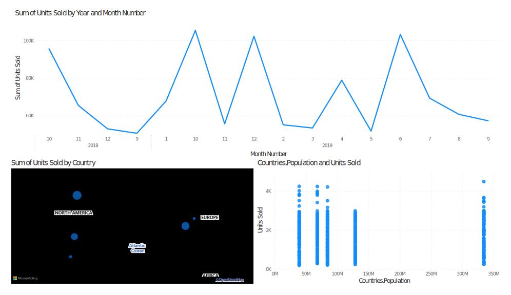

# Microsoft Power BI

Testing Power BI on sample sales data

## Steps

- Start up PowerBI
- Open [`sales.pbix`](sales.pbix)
- Import data [`sales.xlsx`](sales.xlsx)
- Use PowerQuery to filter and process data
- Use the visualization tools to create the dashboard

## Output

## Thoughts

After being used to performing data science programmatically, this feels pretty counter-intuitive to use, but still valuable to be aware of.

## References

[Power BI Reference Video](youtu.be/TmhQCQr_DCA)
